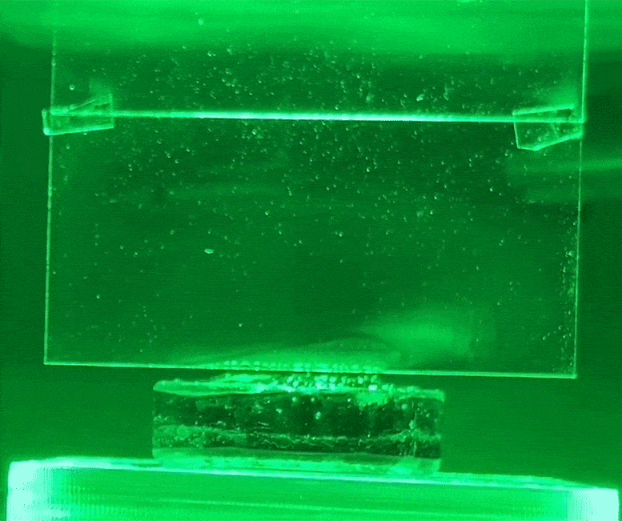

## Photomolecular Effect - Moving Oceans

      

**MIT News:** [Water Evaporation WITHOUT Heat](https://news.mit.edu/2023/surprising-finding-light-makes-water-evaporate-without-heat-1031)

[Contribute to our list of research for RAG training (Google Sheet)](https://docs.google.com/spreadsheets/d/1jQTlXWom-pXvyP9zuTcbdluyvpb43hu2h7anxhF5qlQ/edit?gid=957748871#gid=957748871)  
Please add comments with new resource links.

Creating water vapor using cool green polarized light has the potential to generate abundant clean water.  Cold superthermal evaporation can dry equipment without heat and blowers. We can speed drying time for towels and clothes without heating rooms. Most significantly, we could reduce ocean levels by building-up ice on Antarctica.

During cold super-thermal evaporation via the Photomolecular Effect, photons **cleave-off clusters of water molecules**.

With the optimal green color, 45° angle and polarization, “the evaporation rate is four times the thermal limit. The likeliest first applications will come in the areas of solar desalinization systems or other industrial drying processes. Drying consumes 20% of all industrial energy usage.” - [Guangxin Lv](https://news.mit.edu/2024/how-light-can-vaporize-water-without-heat-0423)

[MIT Study: Solar Photomolecular Desalination](https://jwafs.mit.edu/projects/2022/solar-photomolecular-desalination) &mdash; [Results April 2024](https://www.pnas.org/doi/10.1073/pnas.2320844121)
MIT's Abdul Latif Jameel Water and Food Systems Lab (J-WAFS) awarded a seed grant in 2022<!-- at $75,000 per year for two years-->. 

[JPL: Tracking movement in ground level as aquifers are depleted](https://www.jpl.nasa.gov/edu/news/2024/4/18/tracking-tiny-movements-means-big-impacts-for-earth-science/)
Upcoming Satellite: NASA and the Indian Space Research Organisation  
(The wavelength of radar is about 5 centimeters, which is 50 million nanometers)

<!--
	https://model.georgia.org/localsite/map/#show=wastewater&state=GA&cat=4952

	https://www.source.co
-->

## Help us create Kits for Kids (K-12)

**Cool Light Evaporation Artistic Visualization Experiments (CLEAVE)** 
Using installments of cool light to produce steam as we explore the art of science.

We've listed affordable materials below, like green plastic and polarizing film, for K-12 science experiments. STEAM experiments could also use birefringent materials (crystals) with a [faraday rotator](https://youtu.be/17Y82tJDk2o?si=NTd8OrYJcbRvYvld&t=488).

[Gang Chen's team at MIT](https://meche.mit.edu/people/faculty/gchen2%40mit.edu) initially noticed the cool photomolecular effect in 2021. [Learn more](https://news.mit.edu/2023/surprising-finding-light-makes-water-evaporate-without-heat-1031)

### Questions:

1. What techniques can be used to increase the water surface area exposed to the polarized light? &nbsp;Overlapping layers of glass?

2. At what levels of intensity are there safety issues with the green polarized light? &nbsp;Are there health benefits from polarized light?

3. Can polarized green light beams be sent across distances, including from space?

4. What's the nanometres range for early morning and evening sun? (see below)

## Light Nanometres

**Nanometres (nm)**
Ultraviolet (UV) from 200 to 400 nm - Short wavelength, Invisible. Source of skin cancer at noon.
Blue from 400 to 500 nm
Green from 500 to 600 nm
Red from 600 to 700 nm
Near infrared (NIR) from 700 to 800 nm
Infrared (IR) from 800 to 1200 nm - Longer wavelength, Invisible. - Morning and evening sun is more polarized, with scattering blocking out colors other than red and orange (the long wavelengths).

[Polarized Light Therapy](https://www.sciencedirect.com/science/article/abs/pii/S0378512218303888) - Polarized light penetrates further into tissues. Sunlight exposure, especially in the morning when UV radiation is less intense, helps the body produce vitamin D. Adequate levels of vitamin D are associated with a lower risk of several cancers, including colorectal and breast cancer. Polarized light also has an [anti‐inflammatory effect](https://www.ncbi.nlm.nih.gov/pmc/articles/PMC7065605/).

Early morning and evening light is strongly polarized since it reaches the earth's surface at a shallow 90-degree angle from the original path. In addition, the longer path through the atmosphere causes more scattering and greater polarization as photon rotation syncs during transfering of energy to water molecules via [Raman Scattering](https://en.wikipedia.org/wiki/Raman_scattering). &nbsp;More red and orange occur in the morning due to the greater atmospheric scattering of the shorter blue wavelengths. At noon a higher proportion of short wavelength blue light makes it through narrow atmosphere distance, resulting in a full spectrum white appearance.

## Photomolecular Effect Details

[How light can vaporize water without the need for heat](https://news.mit.edu/2024/how-light-can-vaporize-water-without-heat-0423)
"In the new study, the researchers demonstrate that the hydrogel is not necessary for the process; it occurs at any water surface exposed to light, whether it’s a flat surface like a body of water or a curved surface like a droplet of cloud vapor."

The effect is strongest when polarized green light hits the water surface at an angle of 45 degrees. (the color dependence is not yet accounted for.)

Clouds absorb more sunlight than conventional physics predicts possible.

 

       
      Evaporation from hydrogel using green light

# Noteable Experimental Setup

## Hydrogel

### Material Composition
The hydrogel is a JELL-O-like matrix primarily composed of water within a sponge-like lattice of thin membranes. This structure allows it to hold a significant amount of water and provides a large surface area for light interaction. Although neither water nor the hydrogel material absorbs much light individually, together they become strong absorbers, enhancing evaporation rates by efficiently harnessing photon energy.

### Hydrogel Alternative: [Water Gel Crystals](https://en.wikipedia.org/wiki/Water_crystal_gel)
Orbeez balls or Water Gel Crystals, superabsorbent polymer beads, share properties with hydrogels and might be used in light-induced evaporation experiments. However, key differences exist between Orbeez and the hydrogel used in the MIT experiment.

## Similarities Between Orbeez and Hydrogels
### Water Absorption
Both Orbeez and hydrogels can absorb and retain large amounts of water relative to their size. Orbeez, like hydrogels, possess a gel-like structure composed mostly of water, providing a similar interaction surface for water evaporation experiments.

### Differences and Considerations
Orbeez are made from sodium polyacrylate, while the MIT hydrogel consists of a polymer matrix optimized for light absorption and interaction, enhancing the photomolecular effect. The MIT hydrogel is engineered to maximize absorption of specific wavelengths, particularly green light, to achieve the photomolecular effect. Orbeez may not have these optimized absorption characteristics, potentially reducing the efficiency of light-induced evaporation. The MIT hydrogel was part of a highly controlled setup to measure light's effects on evaporation. Using Orbeez would require ensuring they are similarly shielded from external heat sources and possess suitable light absorption properties to replicate the same conditions.

## Potential for Substitution
While Orbeez could be used in preliminary experiments to observe general light-induced evaporation, achieving the same results as the MIT study would require matching the light absorption properties of the MIT hydrogel and ensuring a controlled experimental setup that isolates light effects from extraneous heat sources.

## Content of Kit

1. Bright, cold LED lights - We use LED lights to avoid heat from sun.

2. Roll of green plastic to filter the light. Additional colors.

3. Roll of polarizing film: (Also referred to as a "polarizing sheets" and "polarizing filter sheets").

4. [14"x52" Reflective Self Adhesive Mirror](https://www.amazon.com/Vailubiri-Reflective-Adhesive-Furniture-Decoration/dp/B0CLGV9F2S/ref=sr_1_10)

5. Two 14"x52" shallow pans for water.

**Experiment:**

Surround the LED lights with mirrors and focus the polarized green light onto surface of water at 45 degrees. Observe if visible mist occurs.

How much LED light energy is required to evaporate one cup of water from the surface of the pan in one hour? Compare change with other pan placed beyond the light.

Compare with and without polarization sheet and green light filter and with other filter colors.

