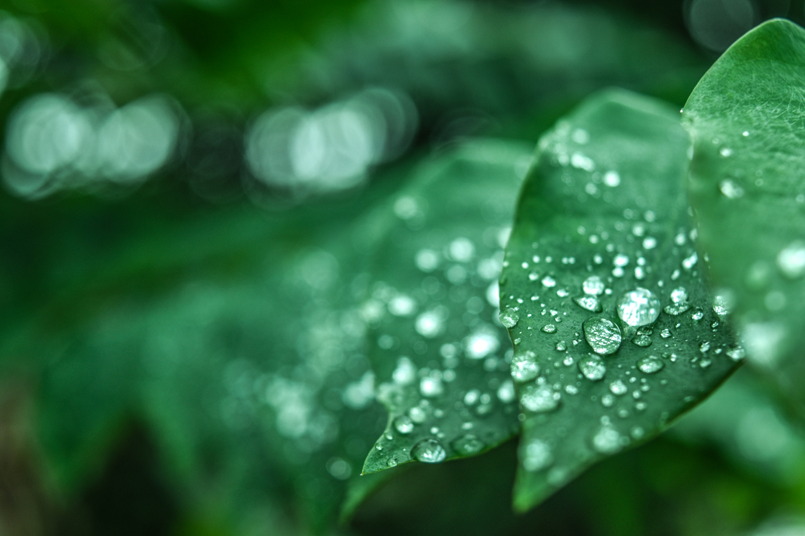

## Photomolecular Effect - Moving Oceans

    

      
    

**MIT News:** [Water Evaporate WITHOUT Heat](https://youtu.be/17Y82tJDk2o?si=NTd8OrYJcbRvYvld&t=488)

SuperThermal Evaporation - Moving water with light and wind has the potential to generate bundant clean water.  Using green polarized light we can dry equipment without heat and blowers, and we can dry ourselves and our towels after showering. Most significantly, we can reduce ocean levels by building-up ice on Antarctica.

### Questions:

1. Can the green light beams be reflected across distances, and from space?

2. What techniques can be used to increase the water surface area exposed to the polarized light?

3. At what levels of intensity are there safety issues with the green polarized light?

4. What's the range for early morning sun?

## Help us Create Kits for Kids

**Cool Light Evaporation (CLEave) Kits for Kids** could use birefringent materials (crystals) with a [faraday rotator](https://youtu.be/17Y82tJDk2o?si=NTd8OrYJcbRvYvld&t=488) for polarizing light.

During cold SuperThermal Evaporation (via the Photomolecular Effect), photons **cleave off clusters of water molecules**

Gang Chen's team at MIT figured out in 2021. [Learn more](https://news.mit.edu/2023/surprising-finding-light-makes-water-evaporate-without-heat-1031)

## Light Nanometres

**nanometres (nm)**
ultraviolet (UV) from 200 to 400 nm - Source of skin cancer
blue from 400 to 500 nm
green from 500 to 600 nm
red from 600 to 700 nm
near infrared (NIR) from 700 to 800 nm
infrared (IR) from 800 to 1200 nm - Longer wave length, early morning?

[Polarized light therapy](https://www.ncbi.nlm.nih.gov/pmc/articles/PMC7065605/) Polarized, light penetrates further into tissues.