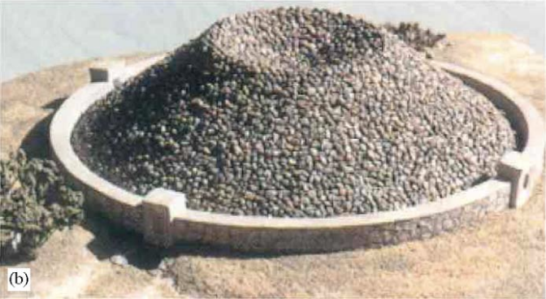
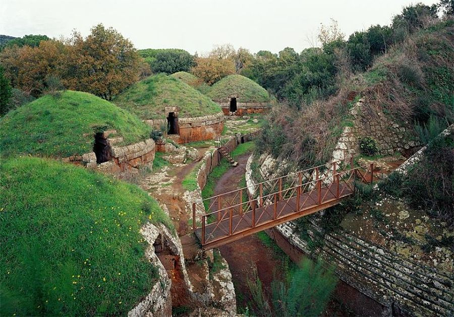

[Evaporation using cold green polarized light](../)
# Aerial wells - Piles of Stones for Condensing Water? (500 BCE)

<!--
Latest update: We've added the Zibold stone condenser experiment (1912), along with a new hypothesis for a large wind-sail to direct moisture up from the ocean into a covering dome - which could have used an outer layer of wood and sail-cloth to loop the wind-flow back down into the bottom of the stone pile before the airflow exited straight up through the top opening. The updraft may have also been useful for communicating with smoke signals. <a href="#windflow">Aerial well windflow details</a>.  
-->

As bazare as it sounds, we have to ask: were family burial structures used for water purification?  The pipes at the 13 Greek Pyramids in Crimea were large enough to carry 14,400 gallons per pyramid per day. Was it simply water from adjacent mountain springs supplying an urban population?

Modern science predicts a maximum of 520 gallons/day if the stone piles were used for water capture. If these ancient structures were indeed aerial wells, had there been a means to include superthermal evaporation to increase output by several factors?  Could superthermal evaporation have been used in ancient industrial processes for the drying of fish, cloth, paper, and pottery containers for shipping? Around 440 BCE, Theodosia became a significant grain-exporting port, supplying Athens and other Greek city-states with wheat.

	<!-- https://u.cs.biu.ac.il/~trakhta/JAE06.pdf -->
 Model of failed Zibold condenser (1912) 
Prior experiments did not include a dome for directing airflow, 
nor a wind-redirecting line of sails to corral moist ocean air.  

<h4>Hypothetical means to amplify ancient water capture (2024)</h4>

1. Build a dome structure over the smooth rock pile. Similar to the round surface of MIT hydrogel polymer, the round shape of the rocks might aid in cleaving H20 in small sheets of molecules to amplify the creation of water vapor on the tops of the rocks.

2. Extend a wind-redirecting structure from the ocean up the hillside using boat-sail fabric to flow large quantities of moist air into the moisture capture domes. Design the dome with two layers. The upper layer would redirect airflow down into the base and up through the cold rocks before existing the dome.  Evaporation reduces surface temperature. Could polarized sunlight aimed at the top of the rocks under the shade of a dome increase evaporative-cooling of the upper rock surfaces exposed to the incoming ocean wind to significantly increase condensation on the bottom of the rocks?

3. From an opening at the top of each dome, hit the rocks with polarized green light at a 45 degree angle. Calcualate the increase in available surface area based on the size of stones along the 45 degree edge of pyramid-shaped structures.  What coatings could be applied to the rock surfaces to further enhance evaporation using polarized light?

	

[Similar necropolises 700 BCE in Rome](https://www.summerinitaly.com/guide/etruscan-necropolises-unesco-site) - Lower "[cave roads](https://www.bbc.com/travel/article/20220922-tuscanys-mysterious-cave-roads)" were walkways that connected communities to water. Could they also have been designed as corridors for channeling cool moist air?  Water was part of the ceremony in Etruscan rituals. Used in libations (liquid offerings) to deities and spirits and maintaining garden areas. Along with bread, fruits, and meats - wine, milk, water, olive oil and honey were common libations symbolizing life, blood, and the connection between the living and the dead. Special bowls, cups, and other vessels were used for pouring libations, often intricately decorated and placed in tombs as grave goods.

## Unsuccessful effort from 1991

SOURCE: [PYRAMID POWER DRAWS WATER FROM AIR](https://www.sun-sentinel.com/1991/12/29/pyramid-power-draws-water-from-air/)

A group of Seattle engineers thought carefully designed modern pyramids of loose rock could in a sense squeeze water from stones.

Desert mice use the technique. So did the ancient Greeks.

A pile of rocks in an arid climate appears capable of capturing and condensing surprising volumes of moisture from the air, using a 2,500-year-old technology now being rediscovered.

The result is water as pure as rain, filtered by the stones, that could provide clean drinking water for desert communities. Worldwide, an estimated 25,000 people a day die of disease caused by polluted water.

The condensation depends on daily heating and cooling by the sun. The resulting water source, dubbed “aerial wells” by one French investigator, would consume no power and require no pumps, moving parts or maintenance.

“There is increasing awareness in the world of the scarcity of water,” said Jose Vila, a retired Boeing engineer who heads Hydrogenesis Inc., a research company based in his Mill Creek, Wash., home. “It is extremely important.”

Joining Vila are Boeing engineer Frederic Henzi, retired University of Washington civil engineering professor Ronald Terrel, and business manager Harold Hopper. Richard Corlett, chairman of mechanical engineering at the University of Washington, is a consultant.

The group received a $50,000 grant from the federal government’s National Science Foundation for preliminary investigation and is sought up to $250,000 more for detailed computer simulations. The third phase would have involved a commercial backer to build an experimental pyramid of loose rock, estimated to cost $63,200 in 1991.

Vila stumbled across the idea while investigating runway construction for Boeing during the Vietnam War. Road engineers in the southwestern U.S. encountered pavement heave from moisture in the middle of deserts, and traced the baffling problem to condensation of water in the road aggregate. They dubbed it “hydrogenesis.”

Investigation subsequently showed that the ancient Greek city of Theodosia in the Crimea, on the Black Sea, apparently captured water from 13 pyramids of loose limestone rock.

The pyramids averaged nearly 40 feet high and were placed on hills around the city. As wind moved air through the heap of stone, the day’s cycle of rising and falling temperature caused moisture to condense, run down, and feed a network of clay pipes.

One archaeologist calculated a water flow of 14,400 gallons per pyramid per day, based on the size of clay pipes leading from each device. Vila’s group thinks that estimate is far too high and estimated a more modest 520 gallons, still more than five times what non-engineered condensation could account for.

“We still don’t know how the Greeks stumbled on it,” Henzi said. “Five centuries before Christ they knew how to do it, and now it’s forgotten.”

Nature may have provided clues. Mice in the Sahara desert, Vila said, pile small heaps of rock in front of their burrow and lick condensed moisture off the stones in the morning.

The engineers do not think the pyramids would pose any environmental problem, because even a network of pyramids would not condense enough moisture out of the vast volumes of desert air to affect downwind rainfall. The main issue, they believe, is cost effectiveness and whether communities liked or disliked the look of pyramids.

The pyramids would not supply enough water for irrigation. But they could have enormous significance for thirsty villages in Africa, the Middle East, Latin America and Pacific islands.

“We know we can get some water, but we don’t know how much,” Henzi said. “However, the fact the Greeks built 13 expensive pyramids 2,500 years ago is evidence this does work.”

More on [ancient aerial well condensers](https://wikidwelling.fandom.com/wiki/Air_well_(condenser))
